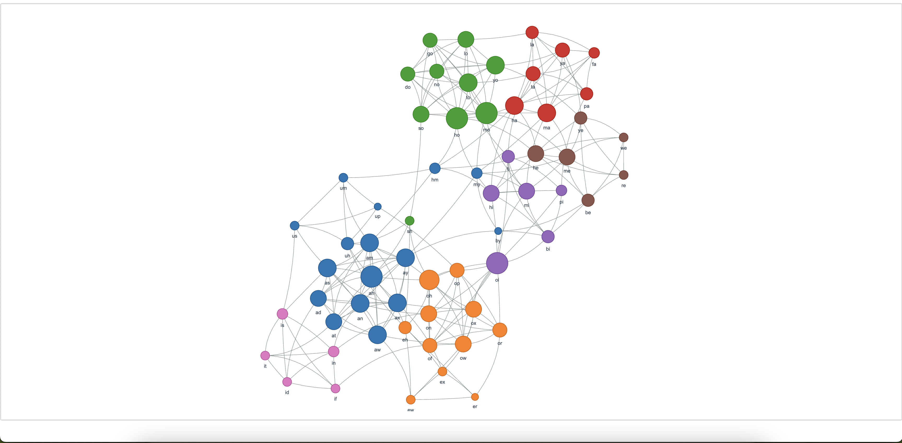
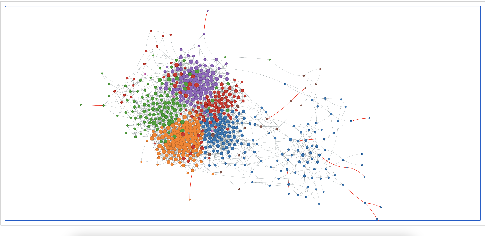
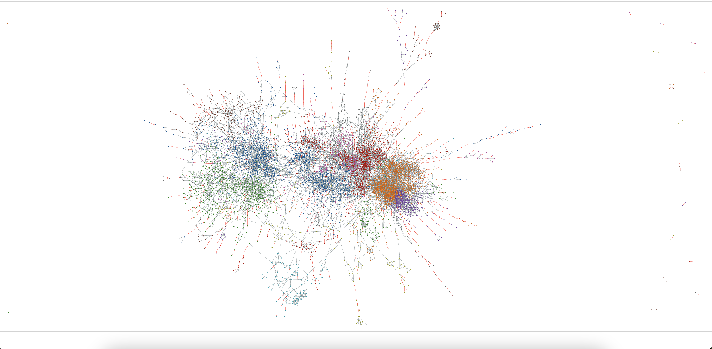
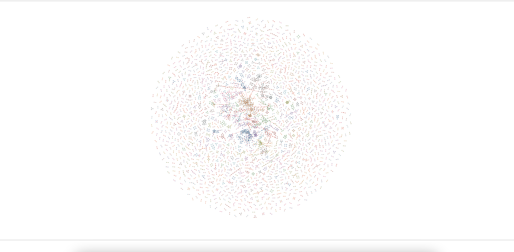
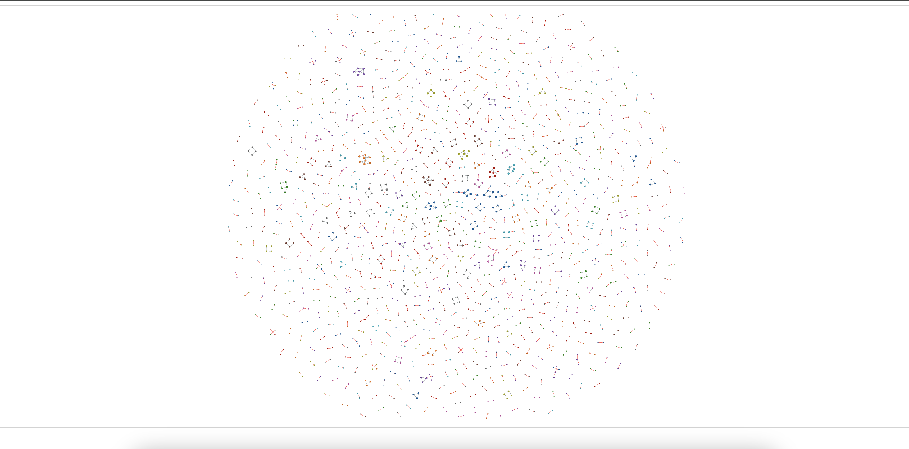

<a href="https://raw.githubusercontent.com/DimitriChrysafis/word-graphs/refs/heads/main/data/2/graph.html" download="graph.html">
  <button style="padding: 10px 20px; font-size: 16px; cursor: pointer; background-color: #4CAF50; color: white; border: none; border-radius: 5px;">Download Graph</button>
</a>

## 2 Letter words  
[URL for preview](data/2/graph.html)  

## 3 Letter words  
[URL for preview](data/3/graph.html)  

## 4 Letter words  
[URL for preview](data/4/graph.html)  

## 5 Letter words  
[URL for preview](data/5/graph.html)  

## 6 Letter words  
[URL for preview](data/6/graph.html)  

## 7 Letter words  
[URL for preview](data/7/graph.html)  

## 8 Letter words  
[URL for preview](data/8/graph.html)  

## 9 Letter words  
[URL for preview](data/9/graph.html)  

## 10 Letter words  
[URL for preview](data/10/graph.html)  

## 11 Letter words  
[URL for preview](data/11/graph.html)  

## 12 Letter words  
[URL for preview](data/12/graph.html)  

## 13 Letter words  
[URL for preview](data/13/graph.html)  

## 14 Letter words  
[URL for preview](data/14/graph.html)  

